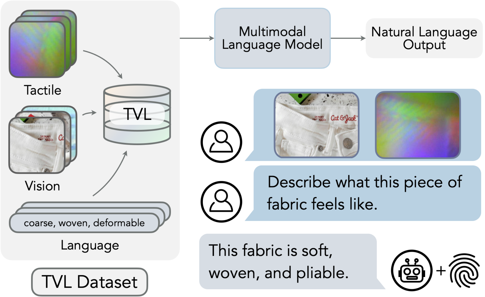

# A Touch, Vision, and Language Dataset for Multimodal Alignment
by <a href="https://max-fu.github.io">Max (Letian) Fu</a>, <a href="https://www.linkedin.com/in/gaurav-datta/">Gaurav Datta*</a>, <a href="https://qingh097.github.io/">Huang Huang*</a>, <a href="https://autolab.berkeley.edu/people">William Chung-Ho Panitch*</a>, <a href="https://www.linkedin.com/in/jaimyn-drake/">Jaimyn Drake*</a>, <a href="https://joeaortiz.github.io/">Joseph Ortiz</a>, <a href="https://www.mustafamukadam.com/">Mustafa Mukadam</a>, <a href="https://scholar.google.com/citations?user=p6DCMrQAAAAJ&hl=en">Mike Lambeta</a>, <a href="https://lasr.org/">Roberto Calandra</a>, <a href="https://goldberg.berkeley.edu">Ken Goldberg</a> at UC Berkeley, Meta AI, TU Dresden, and CeTI (*equal contribution).

[[Paper](https://arxiv.org/abs/2402.13232)] | [[Project Page](https://tactile-vlm.github.io/)] | [[Checkpoints](https://huggingface.co/mlfu7/Touch-Vision-Language-Models)] | [[Dataset](https://huggingface.co/datasets/mlfu7/Touch-Vision-Language-Dataset)] | [[Citation](#citation)]

<p align="center">
  
</p>


This repo contains the official implementation for *A Touch, Vision, and Language Dataset for Multimodal Alignment*. This code is based [MAE](https://github.com/facebookresearch/mae), [CrossMAE](https://github.com/TonyLianLong/CrossMAE), and the [ImageBind-LLM](https://github.com/OpenGVLab/LLaMA-Adapter/tree/main/imagebind_LLM) repos.

## Instructions
Please install the dependencies in `requirements.txt`:
```sh
# Optionally create a conda environment
conda create -n tvl python=3.10 -y
conda activate tvl
conda install pytorch==2.1.2 cudatoolkit==11.8.0 -c pytorch -y
# Install dependencies
pip install packaging
pip install -r requirements.txt
pip install -e . 
```

## Dataset
The dataset is hosted on [HuggingFace](https://huggingface.co/datasets/mlfu7/Touch-Vision-Language-Dataset). To use the dataset, we first download them using the GUI or use git:
```bash
# install git-lfs
sudo apt install git-lfs
git lfs install
# clone the dataset
git clone git@hf.co:datasets/mlfu7/Touch-Vision-Language-Dataset
# or you can download the zip files manually from here: https://huggingface.co/datasets/mlfu7/Touch-Vision-Language-Dataset/tree/main
cd Touch-Vision-Language-Dataset
zip -s0 tvl_dataset_sharded.zip --out tvl_dataset.zip
unzip tvl_dataset.zip 
```

## Models
Touch-Vision-Language (TVL) Models can be separated into 1) tactile encoders that are aligned to the CLIP latent space and 2) TVL-LLaMA, a variant of [ImageBind-LLM](https://github.com/OpenGVLab/LLaMA-Adapter/tree/main/imagebind_LLM) that is finetuned on the TVL dataset. The tactile encoders come in three different sizes: ViT-Tiny, ViT-Small, and ViT-Base. As a result, we provide three different TVL-LLaMA. *The statistics presented here differ from those in the paper as the checkpoints are re-trained using this repository.*

### Tactile Encoders
For zero-shot classification, we use [OpenCLIP](https://github.com/mlfoundations/open_clip) with the following configuration:
```bash
CLIP_VISION_MODEL = "ViT-L-14"
CLIP_PRETRAIN_DATA = "datacomp_xl_s13b_b90k"
``` 
The checkpoints for the tactile encoders are provided below:

<table><tbody>
<!-- START TABLE -->
<!-- TABLE HEADER -->
<th valign="bottom"></th>
<th valign="bottom">ViT-Tiny</th>
<th valign="bottom">ViT-Small</th>
<th valign="bottom">ViT-Base</th>
<!-- TABLE BODY -->
<tr><td align="left">Tactile Encoder</td>
<td align="center"><a href='https://huggingface.co/mlfu7/Touch-Vision-Language-Models/resolve/main/ckpt/tvl_enc/tvl_enc_vittiny.pth?download=true'>download</a></td>
<td align="center"><a href='https://huggingface.co/mlfu7/Touch-Vision-Language-Models/resolve/main/ckpt/tvl_enc/tvl_enc_vits.pth?download=true'>download</a></td>
<td align="center"><a href='https://huggingface.co/mlfu7/Touch-Vision-Language-Models/resolve/main/ckpt/tvl_enc/tvl_enc_vitb.pth?download=true'>download</a></td>
</tr>
<tr><td align="left">Touch-Language Acc (@0.64)</td>
<td align="center">36.19%</td>
<td align="center">36.82%</td>
<td align="center">30.85%</td>
</tr>
<tr><td align="left">Touch-Vision Acc</td>
<td align="center">78.11%</td>
<td align="center">77.49%</td>
<td align="center">81.22%</td>
</tr>
</tbody></table>

### TVL-LLaMA
Please request access to the pre-trained LLaMA-2 from this [form](https://llama.meta.com/llama-downloads/). In particular, we use `llama-2-7b` as the base model. The weights here contains the trained [adapter](https://arxiv.org/abs/2309.03905), the tactile encoder, and the vision encoder for the ease of loading. 
The checkpoints for TVL-LLaMA are provided below:
<table><tbody>
<!-- START TABLE -->
<!-- TABLE HEADER -->
<th valign="bottom"></th>
<th valign="bottom">ViT-Tiny</th>
<th valign="bottom">ViT-Small</th>
<th valign="bottom">ViT-Base</th>
<!-- TABLE BODY -->
<tr><td align="left">TVL-LLaMA</td>
<td align="center"><a href='https://huggingface.co/mlfu7/Touch-Vision-Language-Models/resolve/main/ckpt/tvl_llama/tvl_llama_vittiny.pth?download=true'>download</a></td>
<td align="center"><a href='https://huggingface.co/mlfu7/Touch-Vision-Language-Models/resolve/main/ckpt/tvl_llama/tvl_llama_vits.pth?download=true'>download</a></td>
<td align="center"><a href='https://huggingface.co/mlfu7/Touch-Vision-Language-Models/resolve/main/ckpt/tvl_llama/tvl_llama_vitb.pth?download=true'>download</a></td>
</tr>
<tr><td align="left">Reference TVL Benchmark Score (1-10)</td>
<td align="center">5.03</td>
<td align="center">5.01</td>
<td align="center"> 4.87</td>
</tr>
</tbody></table>

## Training And Evaluation
We provide tactile encoder training script in [tvl_enc](tvl_enc/README.md) and TVL-LLaMA training script in [tvl_llama](tvl_llama/README.md). In particular, **TVL-Benchmark** is described [here](tvl_llama/README.md#tvl-benchmark).

## License
This project is under the Apache 2.0 license. See [LICENSE](LICENSE.txt) for details.

## Citation
Please give us a star 🌟 on Github to support us!

Please cite our work if you find our work inspiring or use our code in your work:
```
@article{fu2024tvl,
    title={A Touch, Vision, and Language Dataset for Multimodal Alignment}, 
    author={Letian Fu and Gaurav Datta and Huang Huang and William Chung-Ho Panitch and Jaimyn Drake and Joseph Ortiz and Mustafa Mukadam and Mike Lambeta and Roberto Calandra and Ken Goldberg},
    journal={arXiv preprint arXiv:2402.13232},
    year={2024}
}
```
